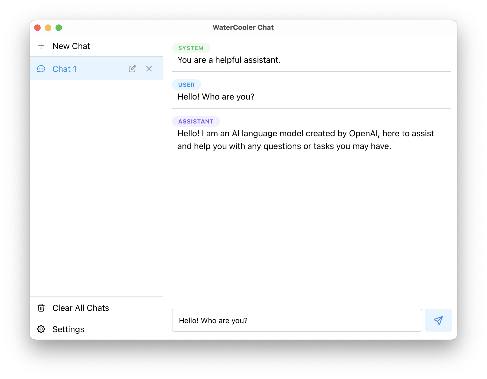
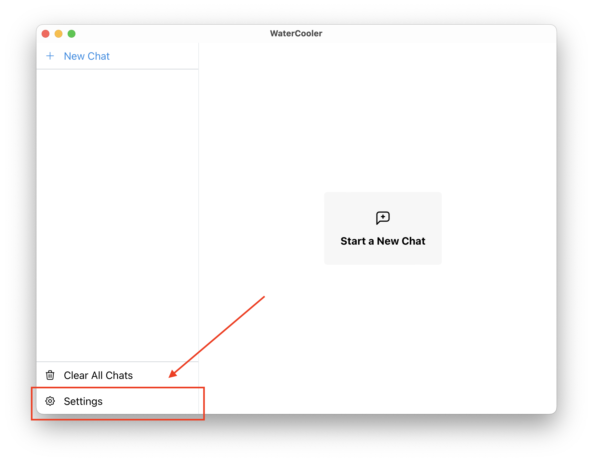
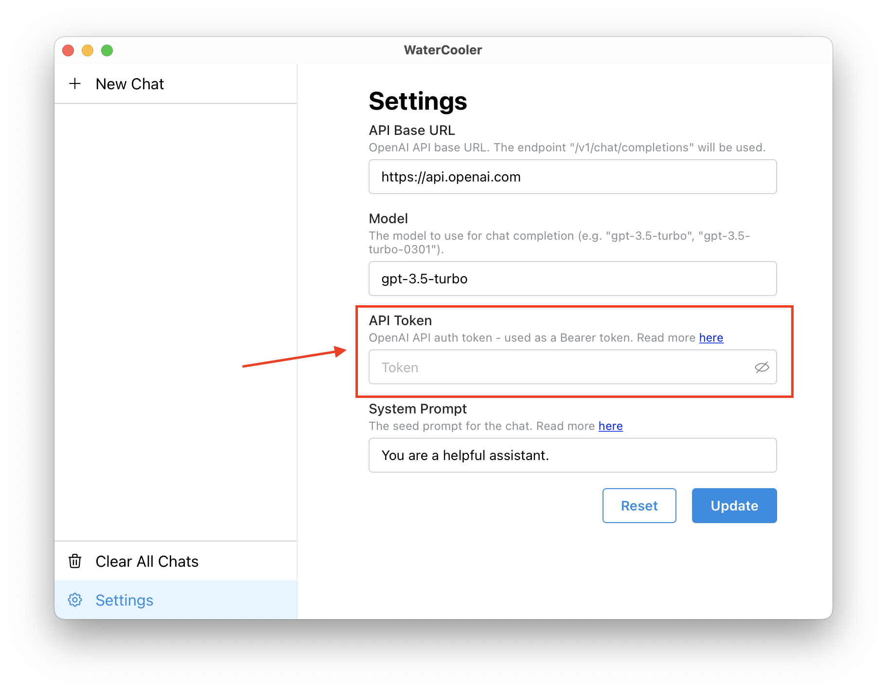
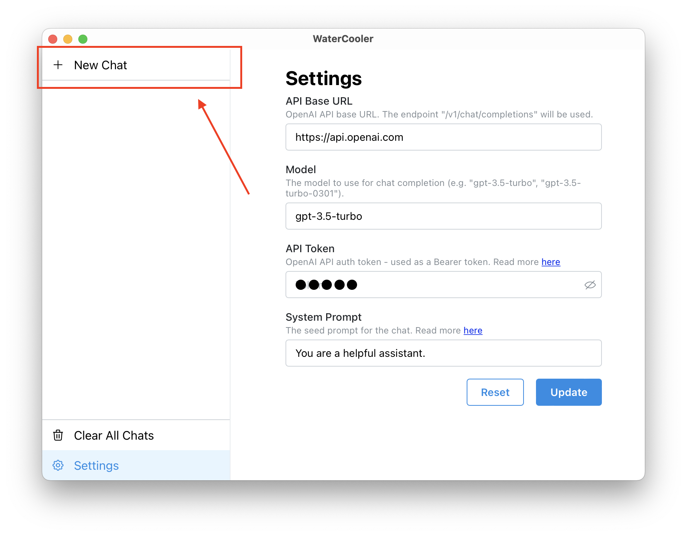
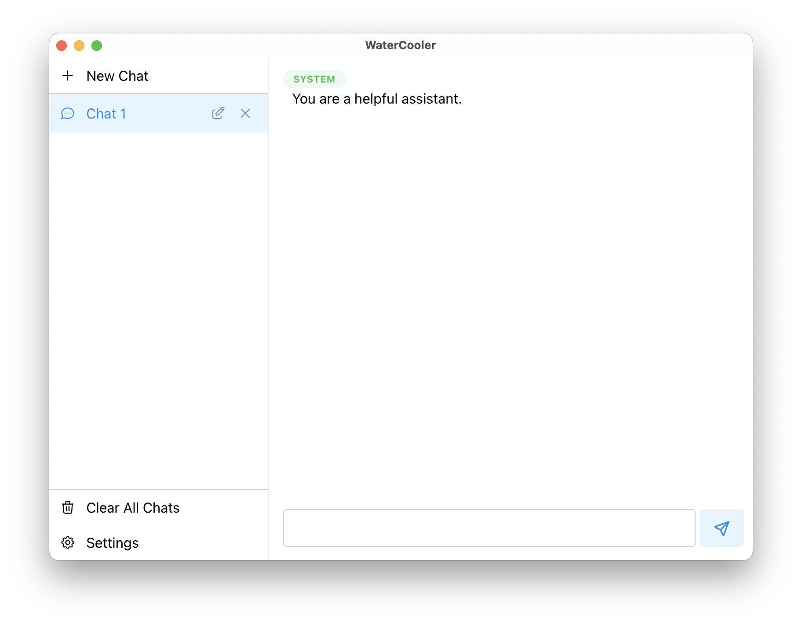

# WaterCooler



[](https://github.com/a-poor/watercooler/actions/workflows/publish.yml)


_created by Austin Poor_

WaterCooler is an open source, desktop GUI for interacting with ChatGPT, created with [Tauri](https://tauri.app).


## Installing

Pre-build binaries can be found in the releases tab. [here](https://github.com/a-poor/watercooler/releases).

Alternatively, the app can be build from source with the following command:

```sh
$ pnpm tauri build
```

You can read more about building the app in the Tauri docs, [here](https://tauri.app/v1/guides/building/).


## Getting Started



After installing, start by going to the `Settings` tab in the left nav panel and...



...putting in your OpenAI auth token. (You can find more info on getting an OpenAI auth token [here](https://platform.openai.com/docs/api-reference/authentication)).



Then, you can start a new chat by clicking the "+ New Chat" button in the left nav panel.



WaterCooler will automatically seed the chat with your configured system prompt (can also be set in the `Settings` tab).

You can learn more about the system prompt [here](https://platform.openai.com/docs/guides/chat/introduction).

Now you're ready to start chatting!


## Misc.

If you want to test out some requests before sending requests to OpenAI's API, I created a (_very_ basic) mock of the OpenAI chat completion API
to help with testing.

You can find the code here: [a-poor/openai-api-mock](https://github.com/a-poor/openai-api-mock)


## Contributing

Feedback and contributions are welcome! Feel free to create an issue or reach out to me on [Mastodon](https://mastodon.social/@austinpoor).

